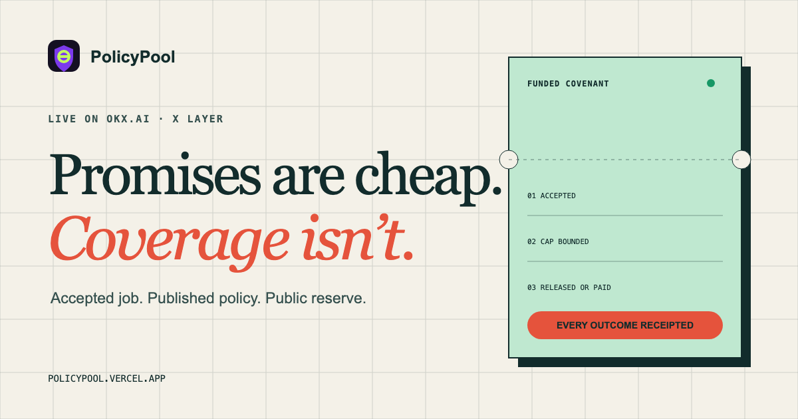

# PolicyPool

[](https://policypool.vercel.app)

PolicyPool is a reserve-backed software warranty layer for agent work on X Layer. It verifies an accepted OKX.AI job against a registered policy snapshot, settles the paid coverage call, reserves a bounded liability, and produces a receipt that can be replayed without trusting the website.

The current promise is deliberately narrow:

> If a covered OKX.AI job remains accepted and undelivered after its stored deadline, PolicyPool records a payout due. A payout becomes paid only after a matching X Layer token transfer from the reserve to the buyer is independently verified.

PolicyPool does not rate subjective quality, accept caller-supplied policy overrides, trust caller clocks or breach flags, or treat an arbitrary transaction hash as payment proof.

**Live surfaces:**
[Agent Coverage](https://policypool.vercel.app) ·
[Free coverage preflight](https://policypool.vercel.app/api/coverage-preflight) ·
[Paid API](https://policypool.vercel.app/api/covered-job-receipt) ·
[Integration manifest](https://policypool.vercel.app/api/manifest) ·
[Coverage ledger](https://policypool.vercel.app/api/coverage-ledger) ·
[External usage proof](https://policypool.vercel.app/proof#external-usage) ·
[OKX.AI Agent #4674](https://www.okx.ai/agents/4674) ·
[v4 foundation](https://policypool.vercel.app/hook)

> **Genesis submission scope:** Agent Coverage is the current OKX.AI product and submission. The v4 liquidity-covenant implementation is the historical X Layer foundation retained below, not the listed Genesis service.

> **v0.4 development status:** universal provider opt-in is implemented on the isolated `v0.4-universal-coverage` branch but is feature-gated, undeployed, and unaudited. Production remains v0.3. See [Universal Coverage v0.4](docs/UNIVERSAL_COVERAGE_V04.md).

## Agent Coverage Loop

1. The target agent must have a versioned policy snapshot in `api/lib/policy-registry.js`.
2. The free preflight accepts an OKX.AI task URL or public task ID, reads the public task state, resolves its onchain evidence, and returns a signed short-lived quote bound to that job and buyer. Advanced callers may still supply the resolved evidence directly to the paid endpoint.
3. `api/lib/chain.js` verifies both transactions against the public task escrow and binds buyer, job, provider wallet, agent ID, token, paid amount, service type, and the exact accepted-service hash. The coverage payer must own the target job.
4. The paid endpoint recovers the canonical request from the quote URL, x402 requirements, request body, or exactly one open quote for the verified payer. Zero or multiple payer matches fail without settlement. Direct full-body requests reject a visibly non-accepted task before returning a payment challenge, and the full eligibility pass runs again before a valid signed service payment is settled.
5. The durable ledger atomically checks that active, pending, and payout-due liabilities plus the new cap do not exceed the live reserve.
6. Each provider policy publishes an enrollment window. The deadline is derived from the verified acceptance block plus the registered target-policy SLA; callers cannot shorten or extend either clock.
7. The scheduled reconciler reads `getJobStatus(bytes32)`. An accepted job still undelivered after that derived deadline becomes `payout_due`; a completed or refunded job releases capacity. State changes and failures alert the operator.
8. `record-payout` accepts no caller assertion. It marks a covenant paid only after verifying reserve wallet, buyer, token, and exact amount in the payout transaction.

The marketplace keeps its own escrow and order lifecycle. PolicyPool adds a capped warranty credit; it is not protocol-native escrow or insurance.

## Current Scope

- Listed service: `Covered Job Receipt`, 0.1 USDT, API service.
- Listed provider: PolicyPool Agent `#4674` on OKX.AI.
- Active registered targets in v0.3: GlassDesk `#3465` services `#30019`, `#30020`, and `#30021`; Foreman `#4348` service `#33357`.
- External provider opt-in: Warden `#3808` service `#33461`, with a 0.5 USD₮0 cap and a 300-second clock from funded endpoint arrival. Coverage remains pre-payment blocked until that provider-side start event can be independently verified.
- Payment asset: X Layer USD₮0, 6 decimals, EIP-3009 domain `USD₮0` version `1`.
- Objective breach: accepted job still undelivered after the stored deadline.
- Reserve: public X Layer wallet, with every liability exposed by `/api/coverage-ledger`.
- Payout execution: reserve operator transfer, followed by independent onchain verification. The current release does not claim autonomous custody or automatic transfer execution.
- Commercial minimum: `0.5 USD₮0` of requested coverage for a `0.1 USDT` service fee. Smaller requests are declined by the free preflight before payment.

Unknown targets are rejected before payment and produce no coverage receipt. Jobs that are already submitted or terminal are not issued new coverage. The cap cannot exceed the target-job value, configured maximum, or uncommitted reserve.

The accepted-event service hash is preserved verbatim and checked for A2A/A2MCP consistency. OKX does not expose a documented public derivation from listed service ID to that hash, so the current verifier does not claim that mapping; proof packages pair the onchain hash with separate marketplace service evidence.

## Universal Opt-In v0.4

v0.4 replaces the manual allowlist as the growth path without creating unbacked provider-agnostic coverage. Any OKX.AI provider can enroll one exact service by proving agent ownership, depositing provider-owned first-loss USD₮0, and signing versioned objective terms. Every quote revalidates ownership, service fingerprint, policy state, expiry, and available bond. A changed listing fails closed until re-enrollment.

The branch includes a bond vault, policy registry, covenant manager, A2A and A2MCP clocks, covenant-bound relay grants, deduplicated buyer demand signals, an enrollment UI, a one-minute reconciler, and an SDK. Shared-reserve co-coverage and provider premiums are disabled. Final payout remains operator-approved against independently verified recovery evidence.

## Controlled Lifecycle Proof

These are explicitly labeled house proof runs and are excluded from external-usage and qualified-revenue claims.

| Proof | Public evidence |
| --- | --- |
| Completed job released its `0.5 USD₮0` liability | [`ppc-d99d7f72895d70ab`](https://policypool.vercel.app/api/coverage-status?receiptId=ppc-d99d7f72895d70ab) |
| Accepted job remained undelivered past its derived deadline | [`ppc-bd38c81112102af0`](https://policypool.vercel.app/api/coverage-status?receiptId=ppc-bd38c81112102af0) |
| Coverage purchase settled on X Layer | [`0x48b7…aae8`](https://www.oklink.com/x-layer/tx/0x48b71f1d1de04e9e7138db3d0a8c7aa20c1a5d0364e465210f5dbeb9da03aae8) |
| Reserve paid the buyer exactly `0.5 USD₮0` | [`0x492a…dffa`](https://www.oklink.com/x-layer/tx/0x492a8e5effbbf9fc2b064c3da0435d797fc2f498967439a970e97439908adffa) |
| Live reserve and liabilities after payout | [Public coverage ledger](https://policypool.vercel.app/api/coverage-ledger) |

## Agent Verification

```bash
npm install
npm run agent:gate
```

`agent:gate` runs syntax checks, adversarial payment/accounting tests, a live X Layer acceptance-proof replay, the chat safety probe, and the web build.

The coverage preflight is free and read-only. It never reserves capacity or signs a payment. A green result returns a signed quote and a backward-compatible canonical body. Use `paidRequest.endpoint` as returned; the paid request must come from the target job's verified buyer wallet. The endpoint rechecks job state, policy version, enrollment window, SLA, target-job value, and reserve capacity before settlement, even when a marketplace drops the replay body.

```bash
npm run agent:verify-live
```

The no-secret live verifier checks `HEAD 200`, unpaid `402`, the exact X Layer payment domain, rejection of generic or malformed payment headers, reserve solvency, and the controlled breach payout directly from its X Layer transaction receipt. It does not sign or spend a payment.

Required production configuration is documented in `.env.example`. The paid route fails closed unless a durable Redis ledger, dedicated quote secret, and real settlement facilitator are configured. QStash is an optional primary reconciler; the repository's GitHub schedule remains the backup.

## Repository Map

```text
api/covered-job-receipt.js       # paid guard + coverage decision
api/coverage-preflight.js        # free OKX task URL resolver + eligibility check
api/coverage-ledger.js           # public reserve and liability ledger
api/coverage-status.js           # one receipt plus live target-job status
api/reconcile-coverage.js        # authenticated objective-state reconciler
api/manifest.js                  # versioned machine-readable integration contract
api/record-payout.js             # authenticated payout transaction verifier
api/lib/payment.js               # official x402 decode, verify, settle, transfer proof
api/lib/chain.js                 # OKX task and token evidence on X Layer
api/lib/okx-task-page.js         # strict public OKX task-page parser
api/lib/ledger.js                # atomic durable liability accounting
api/lib/quote.js                 # signed quote issue, resolve, and payer recovery
api/lib/notifier.js              # operator transition and failure alerts
api/lib/policy-registry.js       # versioned server-owned policy snapshots
api/provider-enrollment.js       # v0.4 signed provider policy enrollment
api/provider-bond.js             # provider-owned first-loss deposit builder
api/provider-relay.js            # covenant-authorized A2MCP clock relay
api/reconcile-universal.js       # v0.4 autonomous lifecycle reconciler
src/ProviderBondVault.sol        # provider first-loss custody and withdrawal queue
src/AgentPolicyRegistry.sol      # versioned owner/fingerprint-bound policies
src/CoverageManager.sol          # provider-funded covenant lifecycle
scripts/verify-agent-api.mjs     # adversarial unit/integration gate
scripts/verify-okx-task-evidence.mjs # real OKX acceptance proof replay
scripts/verify-coverage-preflight.mjs # preflight parser, eligibility, and request tests
web/home.html                    # current multi-page agent-coverage entry
web/enroll.html                  # v0.4 provider enrollment workbench
```

## v4 Foundation

PolicyPool is the liquidity covenant layer for X Layer markets: liquidity that can say no, or charge overflow to pay LPs first. LPs and market operators publish enforceable trading terms, max swap size, daily volume caps, refusal, and LP-first surge, enforced before capital moves with onchain receipts.

The first adapter is a Uniswap v4 hook live on X Layer mainnet: each pool publishes the exact-input swap size and daily volume limits its liquidity will accept before execution, and over-cap flow either refuses in `beforeSwap`, or goes through PolicyPool Surge, where a trusted router donates a surge fee to in-range LPs before executing the swap inside the same v4 unlock. The covenant engine is execution-agnostic by design, so the same terms extend to launchpad pools and Exchange OS venues as new adapters.

First proven at the OKX X Layer Hook the Future hackathon (2nd place).

CI: [](https://github.com/dolepee/policypool/actions/workflows/test.yml)

Historical v4 links:
[v4 app](https://policypool.vercel.app/hook) ·
[Simulator](https://policypool.vercel.app/simulate) ·
[Registry](https://policypool.vercel.app/registry) ·
[Liquidity Covenant Note](docs/LIQUIDITY_COVENANTS.md) ·
[Judge guide](docs/JUDGE_GUIDE.md) ·
[Reviewer questions](docs/JUDGE_GUIDE.md#reviewer-questions) ·
[Hook invariants](docs/HOOK_INVARIANTS.md) ·
[Adoption path](docs/ADOPTION_PATH.md) ·
[Security notes](docs/SECURITY_NOTES.md)

## Historical v4 Proof Path

1. Open the [v4 foundation](https://policypool.vercel.app/hook) and read the first screen: `Policy bends. LPs get paid.`
2. Click the featured Surge proof or scroll to the proof ledger.
3. Verify the Surge proof: the trusted surge router donates `40 mUSDC`, then executes a `5,000 mUSDC` swap in the same v4 unlock.
4. Verify the spoof-guard proof: surge-looking `hookData` through the old router falls back to `MAX_SWAP_EXCEEDED`.
5. Verify the V1 covenant proofs: a `5,000 mUSDC` exact-input order is accepted by the loose pool, refused by the strict pool, and the strict pool later refuses the third `1,000 mUSDC` fill with `DAILY_CAP_EXCEEDED`.
6. Run the one-command verifier:

```bash
node scripts/verify-all.mjs
```

The final proof section should include:

```text
✓ loose pool accepts 5,000 mUSDC (5000 mUSDC)
✓ strict pool refuses 5,000 mUSDC by max-swap covenant (MAX_SWAP_EXCEEDED, attempted 5000 mUSDC, limit 1000 mUSDC)
✓ strict pool accepts first 1,000 mUSDC daily-cap fill (1000 mUSDC)
✓ strict pool accepts second 1,000 mUSDC daily-cap fill (1000 mUSDC)
✓ strict pool refuses third 1,000 mUSDC by daily-cap covenant (DAILY_CAP_EXCEEDED, attempted 3000 mUSDC, limit 2000 mUSDC)
PolicyPool proof verified on X Layer.
✓ surge hook deployment and policy verified
✓ surge swap donated 40 mUSDC and executed 5,000 mUSDC in one tx
✓ untrusted router hookData falls back to V1 max-swap refusal
PolicyPool Surge proof verified on X Layer.
```

## Pool Covenants

PolicyPool makes the pool's execution limits explicit and enforceable. A pool creator can publish a small covenant that defines the maximum exact-input swap size and the rolling daily volume the pool will accept.

This keeps the v1 primitive narrow:

- The covenant belongs to the pool, not to a trader account.
- The Hook checks the covenant before swap execution.
- Accepted swaps emit `SwapAccepted`.
- Refused swaps revert with `PolicyBlocked`.
- The optional demo router catches refusals and emits `SwapBlockedCaught` for easier indexing.

## MVP Scope

PolicyPool keeps the first submission deliberately narrow:

- One Hook: `PolicyPoolHook.sol`
- One covenant schema: `maxSwapAmount`, `dailyCap`, `spentToday`, `lastResetTimestamp`
- One callback: `beforeSwap`
- One proof pair: `MockUSDC / MockETH`
- Two v4 pools using the same Hook but different fee tiers, so they have different `PoolId`s
- Two live proofs:
  - a `5,000 mUSDC` exact-input swap passes the loose pool and fails the strict pool
  - two `1,000 mUSDC` strict-pool swaps pass, then the third fails the daily cap

Cut from v1: slippage caps, asset allowlists, per-LP policy aggregation, governance, oracle checks, Pyth, and frontend swap execution.

## Why This Is A Hook

Standard v4 pools accept any valid swap against available liquidity. PolicyPool moves one decision into the pool itself: before the swap executes, the pool checks whether the trader's requested input fits the covenant attached to that pool.

If the swap fits:

- `beforeSwap` returns successfully
- the Hook emits `SwapAccepted(poolId, trader, amountIn)`
- the v4 swap continues

If the swap breaks the covenant:

- `beforeSwap` reverts with `PolicyBlocked(reason, attempted, limit)`
- no `SwapAccepted` event is emitted
- the v4 swap does not execute

Reverted logs do not persist onchain, so `PolicyPoolDemoRouter.swapOrRecord` can catch a failed strict-pool swap and emit `SwapBlockedCaught`. The Hook still enforces the refusal inside `beforeSwap`; the router event only makes the demo/indexer proof cleaner.

## Why This Is Not A Dynamic Fee Hook

Most obvious v4 Hook ideas change the price of execution: dynamic fees, rebates, points, or routing incentives. PolicyPool changes the permission boundary of execution. The pool can refuse flow before liquidity is consumed.

That distinction is the primitive:

- A dynamic-fee Hook says: "you may swap, but the price changes."
- PolicyPool says: "this pool will not consume its liquidity for that swap."
- The refusal happens inside `beforeSwap`, not in an offchain router or UI.
- The proof is binary and onchain: accepted swaps emit `SwapAccepted`; refused swaps are caught by the demo router with the original `PolicyBlocked` reason.

## Why LPs Would Use It

PolicyPool is not trying to replace permissionless pools. It creates a second pool class for liquidity providers who want bounded flow:

- small teams seeding a new X Layer asset can cap early whale flow;
- treasuries can publish max-swap and daily-volume limits instead of monitoring liquidity manually;
- market makers can run strict and loose pools side by side and expose both policies publicly;
- protocols can prove that liquidity constraints are enforced by the Hook, not by a private backend.

The v1 covenant is intentionally small: `maxSwapAmount` and `dailyCap`. More complex policy belongs in later versions only after the core Hook is proven.

For the market-potential path, see [docs/ADOPTION_PATH.md](docs/ADOPTION_PATH.md).

## PolicyPool Surge

PolicyPool Surge is the one approved v2 upgrade: policy overrides pay LPs instead of silently bypassing the covenant.

Surge keeps the daily-cap gate intact. If an exact-input swap exceeds `maxSwapAmount`, `PolicyPoolSurgeHook` accepts the override only when the v4 `sender` is the authorized `PolicyPoolSurgeRouter` and `hookData` carries a sufficient surge amount. The router proves payment by calling `PoolManager.donate(poolKey, 40 mUSDC, 0)` before `PoolManager.swap(...)` inside the same unlock callback.

The spoof guard is part of the proof. Passing surge-looking `hookData` through the old demo router is treated as no surge and falls back to the V1 `MAX_SWAP_EXCEEDED` refusal.

## Why X Layer

PolicyPool is deployed on X Layer mainnet because the product needs cheap, repeatable swap proofs and an active onchain trading environment. The submission does not stop at deployment: it initializes v4 pools, runs accepted swaps, records max-swap refusal, records daily-cap refusal, records Surge execution, and verifies all of it from X Layer receipts.

## File Structure

```text
src/
  PolicyPoolHook.sol       # beforeSwap covenant enforcement
  PolicyPoolDemoRouter.sol # minimal PoolManager adapter for demo liquidity/swaps
  PolicyHookDeployer.sol   # CREATE2 helper for valid v4 Hook address bits
  PolicyPoolSurgeHook.sol  # v2 trusted-router surge path
  PolicyPoolSurgeRouter.sol # donates surge fee then swaps in one unlock
  PolicySurgeHookDeployer.sol # CREATE2 helper for surge hook address bits
  PolicyTypes.sol          # Policy struct, reasons, errors
  mocks/
    MockERC20.sol
    MockUSDC.sol
    MockETH.sol
script/
  DeployHook.s.sol         # mines BEFORE_SWAP hook address and deploys hook
  DeployDemo.s.sol         # deploys hook, router, mocks, pools, policies, demo swaps
  DeploySurge.s.sol        # deploys surge hook/router/pool and captures surge proofs
  RunDailyCapProof.s.sol   # runs the live strict-pool daily-cap proof
scripts/
  verify-all.mjs           # one-command local + live proof verifier, also used in CI
  verify-live.mjs          # recording-friendly live deployment + proof verifier
  verify-proof.mjs         # dependency-free verifier for live X Layer proof txs
  verify-surge.mjs         # dependency-free verifier for live Surge proof txs
  verify-deployment.mjs    # dependency-free verifier for live deployment state
test/
  PolicyPoolHook.t.sol     # policy unit tests
  PolicyPoolDemoRouter.t.sol # demo router tests
  PolicyPoolIntegration.t.sol # local v4 PoolManager integration tests
  PolicyPoolSurgeRouter.t.sol # surge donate + swap and spoof-guard tests
docs/
  ADOPTION_PATH.md
  HOOK_INVARIANTS.md
  JUDGE_GUIDE.md
  POLICY_SCHEMA.md
  SECURITY_NOTES.md
  DEPLOYMENT_PLAN.md
web/
  index.html               # static judge proof page shell
```

## Hook Callback Plan

`PolicyPoolHook` implements `IHooks` directly instead of depending on a periphery base hook. The contract exposes every required callback and only mutates state in `beforeSwap`.

Callback used:

- `beforeSwap(address sender, PoolKey key, SwapParams params, bytes hookData)`

Callback behavior:

1. Require caller is the configured Uniswap v4 `PoolManager`.
2. Compute `poolId = key.toId()`.
3. Load policy for the pool.
4. Reject missing policy.
5. Reject exact-output swaps.
6. Convert negative `amountSpecified` into exact-input `amountIn`.
7. Reject if `amountIn > maxSwapAmount`.
8. Reset `spentToday` if the 24-hour window elapsed.
9. Reject if `spentToday + amountIn > dailyCap`.
10. Increment `spentToday`.
11. Emit `SwapAccepted`.
12. Return `IHooks.beforeSwap.selector`.

## X Layer v4 Deployment Plan

Official Uniswap v4 deployment docs list X Layer mainnet chain `196` with:

- `PoolManager`: `0x360E68faCcca8cA495c1B759Fd9EEe466db9FB32`
- `PositionManager`: `0xCF1Eafc6928DC385A342E7C6491D371D2871458b`
- `StateView`: `0x76fd297E2D437cd7f76d50F01aFE6160f86e9990`
- `Permit2`: `0x000000000022D473030F116dDEE9F6B43aC78BA3`

Source: https://developers.uniswap.org/docs/protocols/v4/deployments

## X Layer Deployment

Deployed on X Layer mainnet, chain `196`.

| Artifact | Address / tx |
| --- | --- |
| `PoolManager` | [`0x360E68faCcca8cA495c1B759Fd9EEe466db9FB32`](https://www.oklink.com/x-layer/address/0x360E68faCcca8cA495c1B759Fd9EEe466db9FB32) |
| `PolicyHookDeployer` | [`0x904eEf6AFB59754114F10182d1f0564F606d4F73`](https://sourcify.dev/#/lookup/0x904eEf6AFB59754114F10182d1f0564F606d4F73) |
| `PolicyPoolHook` | [`0x7D676FA819D8CDF0A2BB73B944a3533870868080`](https://sourcify.dev/#/lookup/0x7D676FA819D8CDF0A2BB73B944a3533870868080) |
| `PolicyPoolDemoRouter` | [`0xCD46b2C1e6dD9d0fd3Edd9B26F0137E02F3Fc29e`](https://sourcify.dev/#/lookup/0xCD46b2C1e6dD9d0fd3Edd9B26F0137E02F3Fc29e) |
| `MockUSDC` | [`0xBb856B7ce87315eaBF1005861B1b321826a6D33c`](https://sourcify.dev/#/lookup/0xBb856B7ce87315eaBF1005861B1b321826a6D33c) |
| `MockETH` | [`0xEA76c34E0d6d43326c9AB98088536d129242d181`](https://sourcify.dev/#/lookup/0xEA76c34E0d6d43326c9AB98088536d129242d181) |
| `PolicySurgeHookDeployer` | [`0x10B48e541bC8eD94aC0106F1CA69Ffe255479dCB`](https://sourcify.dev/#/lookup/0x10B48e541bC8eD94aC0106F1CA69Ffe255479dCB) |
| `PolicyPoolSurgeHook` | [`0xf44d9C1f9efF1231E53C60EDB9A73761aa99c080`](https://sourcify.dev/#/lookup/0xf44d9C1f9efF1231E53C60EDB9A73761aa99c080) |
| `PolicyPoolSurgeRouter` | [`0xd05AAD5b86f6FFCc10872803bEdb5fa911e0E1fD`](https://sourcify.dev/#/lookup/0xd05AAD5b86f6FFCc10872803bEdb5fa911e0E1fD) |

Pool IDs:

- Loose pool: `0x1f03803fe744002a219a7d74646f3e355130b4afbd073c05afd3684bc70bbbf7`
- Strict pool: `0x1c32ec3d512c6807ba73c5cd32bdf2fe6c3ab07dc3e820340378c728bb5711f7`
- Surge pool: `0x1a024c08b90a1c3534b790c9e6c3c128d54fc9a3703d4882398f27a2d2ac068b`

Proof txs:

| Proof | Tx |
| --- | --- |
| Loose pool initialized | [`0x969e4254336180c5bac71cb9851feacaed2f0fd7c2dabe63b748159909a245a7`](https://www.oklink.com/x-layer/tx/0x969e4254336180c5bac71cb9851feacaed2f0fd7c2dabe63b748159909a245a7) |
| Strict pool initialized | [`0x64793e514c6dd69102f3c4fb459391004bcf47c29fc527328f55afaff2014d46`](https://www.oklink.com/x-layer/tx/0x64793e514c6dd69102f3c4fb459391004bcf47c29fc527328f55afaff2014d46) |
| Loose pool accepted `5,000 mUSDC` swap | [`0x1ee4c6e668306c1ed7dddb0a47cb8c722607f892d03f69746d2822df13423396`](https://www.oklink.com/x-layer/tx/0x1ee4c6e668306c1ed7dddb0a47cb8c722607f892d03f69746d2822df13423396) |
| Strict pool refused same swap and emitted `SwapBlockedCaught` | [`0xbc206a69a3728847dd28e4958e8e7f7d931f6d34d3e84a505103fd6ff0ec435a`](https://www.oklink.com/x-layer/tx/0xbc206a69a3728847dd28e4958e8e7f7d931f6d34d3e84a505103fd6ff0ec435a) |
| Strict pool accepted first `1,000 mUSDC` daily-cap fill | [`0x2a260e92507918a290117e17445aea183b9fa2f1959bbd5719750b487b56f178`](https://www.oklink.com/x-layer/tx/0x2a260e92507918a290117e17445aea183b9fa2f1959bbd5719750b487b56f178) |
| Strict pool accepted second `1,000 mUSDC` daily-cap fill | [`0xc6085e4feaa9e6559a04a21d10eb55503224a86a924c19622e51a31b0a45292b`](https://www.oklink.com/x-layer/tx/0xc6085e4feaa9e6559a04a21d10eb55503224a86a924c19622e51a31b0a45292b) |
| Strict pool refused third `1,000 mUSDC` fill with `DAILY_CAP_EXCEEDED` | [`0x71130fce6387f081b5f2ded837879c38cdd18640fd62a8a11533d48737be771c`](https://www.oklink.com/x-layer/tx/0x71130fce6387f081b5f2ded837879c38cdd18640fd62a8a11533d48737be771c) |
| Surge router donated `40 mUSDC` and executed `5,000 mUSDC` swap | [`0x18096b74138d43a6683f1c914e7aa83633c8ed0ba6a533cf6e7e939f5f7ea9a8`](https://www.oklink.com/x-layer/tx/0x18096b74138d43a6683f1c914e7aa83633c8ed0ba6a533cf6e7e939f5f7ea9a8) |
| Old router could not spoof Surge with hookData | [`0x4877a6cf2214148d8ba0b3ca7d036da1cde7e35a33eeaaf79718f3e54ee4843a`](https://www.oklink.com/x-layer/tx/0x4877a6cf2214148d8ba0b3ca7d036da1cde7e35a33eeaaf79718f3e54ee4843a) |

The V1 and Surge contracts are verified on Sourcify with exact matches. The live Surge receipts are also checked by `scripts/verify-surge.mjs`.

Deployment steps:

1. Deploy `PolicyHookDeployer`.
2. Mine a salt so the Hook address has only `BEFORE_SWAP_FLAG` set in the lower 14 bits.
3. Deploy `PolicyPoolHook` through `PolicyHookDeployer`.
4. Deploy `PolicyPoolDemoRouter`.
5. Deploy `MockUSDC` and `MockETH`.
6. Initialize two v4 pools against the same Hook:
   - Loose pool: fee `3000`, tick spacing `60`
   - Strict pool: fee `10000`, tick spacing `200`
7. Set policies:
   - Loose: `maxSwapAmount = 10,000 mUSDC`, `dailyCap = 50,000 mUSDC`
   - Strict: `maxSwapAmount = 1,000 mUSDC`, `dailyCap = 2,000 mUSDC`
8. Add small demo liquidity to both pools.
9. Run the same `5,000 mUSDC` exact-input swap against both.

## Verify The Live Proof

Run the complete local and live verification path:

```bash
node scripts/verify-all.mjs
```

That command runs formatting, contract build, contract tests, web build, deployment-state verification, and proof-receipt verification.

The same command runs in GitHub Actions, so the public CI check verifies both local code quality and the live X Layer proof path.

For a shorter recording-friendly proof command that skips local build output and checks only the deployed state plus live receipts:

```bash
node scripts/verify-live.mjs
```

Verify deployed contracts, Hook address bits, Hook permissions, PoolManager binding, and pool policy values:

```bash
node scripts/verify-deployment.mjs
```

Expected result:

```text
✓ connected to X Layer mainnet (196)
✓ Uniswap v4 PoolManager bytecode exists at 0x360e68faccca8ca495c1b759fd9eee466db9fb32
✓ PolicyPoolHook bytecode exists at 0x7d676fa819d8cdf0a2bb73b944a3533870868080
✓ PolicyPoolDemoRouter bytecode exists at 0xcd46b2c1e6dd9d0fd3edd9b26f0137e02f3fc29e
✓ MockUSDC bytecode exists at 0xbb856b7ce87315eabf1005861b1b321826a6d33c
✓ MockETH bytecode exists at 0xea76c34e0d6d43326c9ab98088536d129242d181
✓ Hook address bits enable BEFORE_SWAP only
✓ PolicyPoolHook is bound to official X Layer PoolManager
✓ getHookPermissions returns only beforeSwap=true
✓ loose pool policy is set (10000 / 50000 mUSDC)
✓ strict pool policy is set (1000 / 2000 mUSDC)
PolicyPool deployment verified on X Layer.
```

The verifier does more than check that transactions exist. It fetches the X Layer receipts, decodes the accepted
`SwapAccepted` events, unwraps the v4 `WrappedError`, decodes the inner `PolicyBlocked` error, and asserts the exact
attempted amount and covenant limit for both refusal paths.

```bash
node scripts/verify-proof.mjs
```

It currently verifies:

- the loose pool accepted a `5,000 mUSDC` exact-input swap;
- the strict pool refused the same `5,000 mUSDC` swap with `MAX_SWAP_EXCEEDED`;
- the strict pool accepted two `1,000 mUSDC` daily-cap fills;
- the strict pool refused the third fill with `DAILY_CAP_EXCEEDED`.

## Commands

```bash
forge build
forge test -vv
node scripts/verify-all.mjs
node scripts/verify-live.mjs
node scripts/verify-deployment.mjs
node scripts/verify-proof.mjs
```

Environment:

```bash
cp .env.example .env
```

Deploy Hook on X Layer mainnet:

```bash
POOL_MANAGER=0x360E68faCcca8cA495c1B759Fd9EEe466db9FB32 \
PRIVATE_KEY=... \
forge script script/DeployHook.s.sol:DeployHook \
  --rpc-url $XLAYER_RPC_URL \
  --broadcast
```

Full demo deploy on X Layer:

```bash
POOL_MANAGER=0x360E68faCcca8cA495c1B759Fd9EEe466db9FB32 \
PRIVATE_KEY=... \
forge script script/DeployDemo.s.sol:DeployDemo \
  --rpc-url $XLAYER_RPC_URL \
  --broadcast
```

## Test Coverage

Current tests cover:

- policy storage and owner assignment
- invalid policy rejection
- owner-only policy update
- direct `beforeSwap` call protection
- missing policy rejection
- exact-output rejection
- max-swap rejection
- daily-cap rejection
- daily-cap reset after 24 hours
- exact max-swap and exact daily-cap boundary acceptance
- owner-managed policy update behavior
- Hook permission flags
- local v4 PoolManager triggering `beforeSwap`
- loose pool accepted swap through v4 test router
- strict pool rejected swap through v4 test router
- demo router accepted swap
- demo router caught strict-pool refusal and emitted `SwapBlockedCaught`
- live X Layer proof verifier for accepted, max-swap refused, and daily-cap refused outcomes

## No-Video Review Path

The repo and live site are structured so judges can verify PolicyPool without a recorded walkthrough:

1. Open the live hero: `Policy bends. LPs get paid.`
2. Click the featured Surge proof and inspect the `Donate`, Hook `SwapAccepted`, and router `SurgeAccepted` logs.
3. Click the spoof-guard proof and inspect the old-router refusal path.
4. Return to the proof ledger and inspect the V1 covenant baseline: loose accepts `5,000 mUSDC`, strict refuses the same exact-input amount, and daily cap refuses the third fill.
5. Run `node scripts/verify-live.mjs` for the concise live verifier or `node scripts/verify-all.mjs` for the full local + live proof path.

## Current Status

- Hook contract: implemented
- Mock tokens: implemented
- Policy unit tests: passing
- Local v4 integration tests: passing
- Hook deploy script: implemented
- Demo deploy script: implemented
- Pool initialization / liquidity scripts: implemented in `DeployDemo.s.sol`
- Static frontend shell: implemented
- X Layer deployment: complete
- Proof txs: captured
- Daily-cap proof txs: captured
- Live proof verifier: passing
